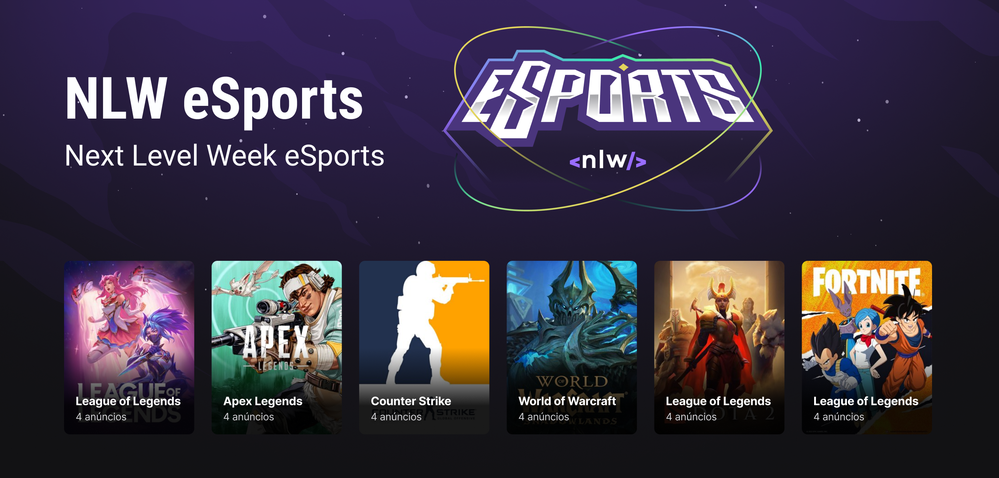

  
  

  <a href="#-tecnologias">Tecnologias</a>&nbsp;&nbsp;&nbsp;|&nbsp;&nbsp;&nbsp;
  <a href="#-projeto">Projeto</a>&nbsp;&nbsp;&nbsp;|&nbsp;&nbsp;&nbsp;
  <a href="#memo-licença">Licença</a>

 
  
  

  

## 🚀 Tecnologias

 
  
  
  
  
  
  

 

## 🚧 Projeto

Live Preview: https://hubkut.vercel.app/
  
<h3 align="center"> 
  
  
</h3>

## ⚙️ Project Running:

Figma: https://www.figma.com/community/file/1105860543512658494

## :memo: Licença

Esse projeto está sob a licença MIT. Veja o arquivo [LICENSE](LICENSE) para mais detalhes.

---
